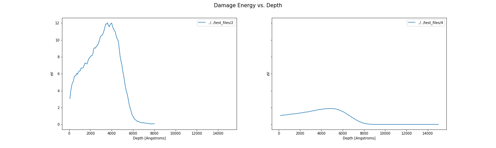
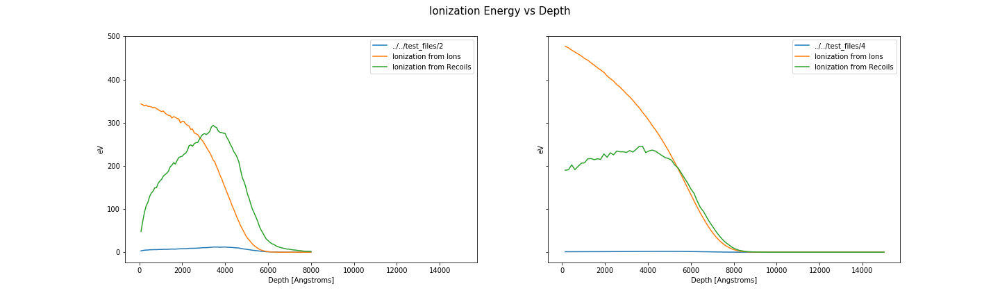
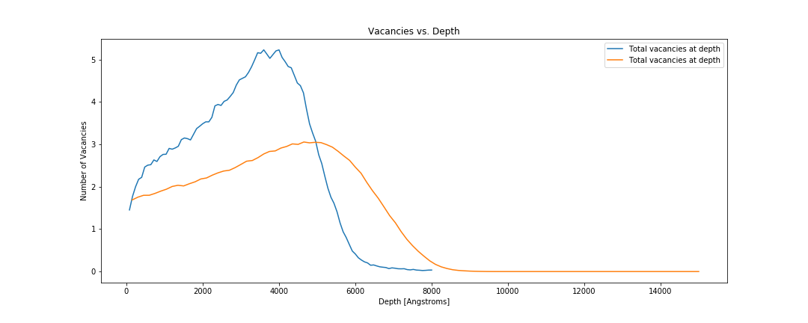

========
Tutorial
========

If you have already installed srim then lets get started! If not
please make sure to look at :ref:`installation` first.

In this tutorial we will cover all of the basics of ``pysrim``.

 - running a TRIM simple calculation
 - analyzing TRIM calculation output files

Most emphasis will be put on what is possible for analysis of SRIM
calculations. Since all output files will be exposed as numpy arrays
the sky is the limit for plotting.

We will assume python 3 for this notebook and you should be using it
too. Python 2.7 is going be depreciated in 2020.

.. code-block:: python

   import os

   import numpy as np
   import matplotlib.pyplot as plt

   from srim import TRIM, Ion, Layer, Target
   from srim.output import Results

There are not too many important objects to import from srim. The
first srim import is for all of the components needed for automating a
SRIM calculation. While the second import is for the output results.

Run a SRIM Calculation
----------------------

Running a srim calculation is much like the gui that SRIM provides.

Concepts:

 - a list of Layers forms a Target
 - a Layer is a dict of elements, with density, and a width
 - an Element can be specified by symbol, atomic number, or name, with a custom mass [amu]
 - an Ion is like an Element except that it also requires an energy in [eV]

.. code-block:: python

   # Construct a 3MeV Nickel ion
   ion = Ion('Ni', energy=3.0e6)

   # Construct a layer of nick 20um thick with a displacement energy of 30 eV
   layer = Layer({
           'Ni': {
               'stoich': 1.0,
               'E_d': 30.0,
               'lattice': 0.0,
               'surface': 3.0
           }}, density=8.9, width=20000.0)

   # Construct a target of a single layer of Nickel
   target = Target([layer])

   # Initialize a TRIM calculation with given target and ion for 25 ions, quick calculation
   trim = TRIM(target, ion, number_ions=25, calculation=1)

   # Specify the directory of SRIM.exe
   # For windows users the path will include C://...
   srim_executable_directory = '/tmp/srim'

   # takes about 10 seconds on my laptop
   results = trim.run(srim_executable_directory)
   # If all went successfull you should have seen a TRIM window popup and run 25 ions!

The following code does a quick SRIM calculation of a 3 MeV Nickel ion
in a nickel target. We have set the displacement energy for Nickel at
30 eV with a density of 8.9 [g/cm^3]. Also notice that after running
the simulation with ``trim.run`` the results are automatically parsed
for us. After the calculation has completed many times we will want to
copy the results to a different directory.

.. code-block:: python

   output_directory = '/tmp/srim_outputs'
   os.makedirs(output_directory, exist_ok=True)
   TRIM.copy_output_files('/tmp/srim', output_directory)

If at a later point you would like to parse the srim calcualtions you
can use the :class:`srim.output.Results` class to gather all the
output.

.. code-block:: python

   srim_executable_directory = '/tmp/srim'
   results = Results(srim_executable_directory)

Plotting and Analysis of Results
--------------------------------

Now we assume that we have completed several interesting SRIM
calculations. For this tutorial we will use `results
<https://gitlab.com/costrouc/pysrim/tree/master/test_files>`_ within
the ``pysrim`` repository. You will need to download these files. We
will analyze results such as damage energy, ionization, and vacancy
production.

.. code-block:: python

   def plot_damage_energy(folder, ax):
        results = Results(folder)
        phon = results.phonons
        dx = max(phon.depth) / 100.0 # to units of Angstroms
        energy_damage = (phon.ions + phon.recoils) * dx
        ax.plot(phon.depth, energy_damage / phon.num_ions, label='{}'.format(folder))
        return sum(energy_damage)

    def plot_ionization(folder, ax):
        results = Results(folder)
        ioniz = results.ioniz
        dx = max(ioniz.depth) / 100.0 # to units of Angstroms
        ax.plot(ioniz.depth, ioniz.ions, label='Ionization from Ions')
        ax.plot(ioniz.depth, ioniz.recoils, label='Ionization from Recoils')

    def plot_vacancies(folder, ax):
        results = Results(folder)
        vac = results.vacancy
        vacancy_depth = vac.knock_ons + np.sum(vac.vacancies, axis=1)
        ax.plot(vac.depth, vacancy_depth, label="Total vacancies at depth")
        return sum(vacancy_depth)

    folders = ['test_files/2', 'test_files/4']
    image_directory = 'examples/images'
    os.makedirs(image_directory, exist_ok=True)

Here we initialize three plotting functions.

Damage energy vs depth.

.. code-block:: python

   fig, axes = plt.subplots(1, len(folders), sharex=True, sharey=True)

   for ax, folder in zip(np.ravel(axes), folders):
       energy_damage = plot_damage_energy(folder, ax)
       print("Damage energy: {} eV".format(energy_damage))
       ax.set_xlabel('Depth [Angstroms]')
       ax.set_ylabel('eV')
       ax.legend()

   fig.suptitle('Damage Energy vs. Depth', fontsize=15)
   fig.set_size_inches((20, 6))
   fig.savefig(os.path.join(image_directory, 'damagevsdepth.png'), transparent=True)

Ionization energy vs depth

.. code-block:: python

   fig, axes = plt.subplots(1, len(folders), sharey=True, sharex=True)

   for ax, folder in zip(np.ravel(axes), folders):
       plot_damage_energy(folder, ax)
       plot_ionization(folder, ax)
       ax.legend()
       ax.set_ylabel('eV')
       ax.set_xlabel('Depth [Angstroms]')
   fig.suptitle('Ionization Energy vs Depth', fontsize=15)
   fig.set_size_inches((20, 6))
   fig.savefig(os.path.join(image_directory, 'ionizationvsdepth.png'), transparent=True)

Total number of vacancies vs depth.

.. code-block:: python

   fig, ax = plt.subplots()

   for i, folder in enumerate(folders):
       total_vacancies = plot_vacancies(folder, ax)
       print("Total number of vacancies {}: {}".format(folder, total_vacancies))

   ax.set_xlabel('Depth [Angstroms]')
   ax.set_ylabel('Number of Vacancies')
   ax.set_title('Vacancies vs. Depth')
   ax.legend()
   fig.set_size_inches((15, 6))
   fig.savefig(os.path.join(image_directory, 'vacanciesvsdepth.png'), transparent=True)

For a much more advanced example please see `SiC ion damage production
jupyter notebook
<https://gitlab.com/costrouc/pysrim/blob/master/examples/notebooks/SiC.ipynb>`_. This
tutorial is also available in `notebook form
<https://gitlab.com/costrouc/pysrim/blob/master/examples/notebooks/Analysis.ipynb>`_.
